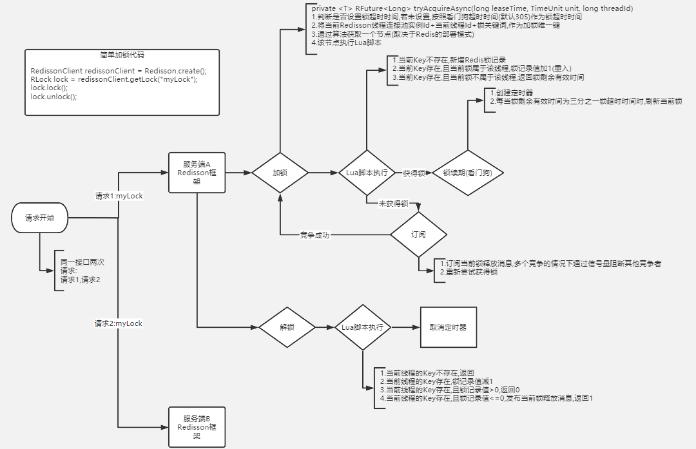

### 一面（30min）
提前和面试官约了时间，但当天临时有事，直接和面试官沟通改了时间，还是很方便高效的。

1. 线程的运行状态和相互转换
   

2. String 和 StringBuilder 和 StringBuffer
   - StringBuilder 和 StringBuffer的char[] 可变,String的char[] 是final
   - StringBuilder  多线程安全不安全
   - StringBuffer 多线程安全 synchronized 修饰
3. SSM 框架，aop 和 ioc
   - SSM
   - aop 面向切面编程
     - jdk 
     - cglib 
   - ioc 依赖注入
4. 抽象类和接口
   - 抽象类 abstract修饰
    - 不能被实例化只能继承
    - 修饰符必须是public或protected,因为需要继承,不能被private,static,synchronized和native修饰
    - 继承后必须实现父类抽象方法
    - 构造方法不能用于实例化,主要用途是被子类调用
   - 接口 interface
    - 变量 public static final
    - 方法 public abstract
    - 支持多继承
    - 类支持实现多接口
5. 数据库分库分表 
    - [美团技术团队](https://tech.meituan.com/2016/11/18/dianping-order-db-sharding.html)
6. lambda 表达式
    - 必须要有自定义函数接口
    - 匿名类:仍然是类,编译器会自动为其取名并产生class文件,invokespecial
    - Lambda表达式,通过invokedynamic指令实现,不产生新的类
      封装成主类的一个私有方法，Lambda表达式和外层共用this
7. 使用 HashMap 时，key=null 会怎么样，怎么处理？放在 table[0] 处。
   - hash(null) == 0;
## 秋招
### 一面（30min）
1. 定时任务框架怎么设计？
   - 
2. Quartz 也可以单机触发，那大家都触发怎么办？分布式锁

3. 分布式锁的实现？zookeeper 分布式锁，redis 分布式锁
   - redis redisson
     - 原子性: lua脚本
     - 锁时间: 看门狗
     - 同步: 订阅通知
     

   - zookeeper Curator
     - 原子性: leader
     - 锁时间: 连接断开后删除接口
     - 同步: 临时顺序节点的订阅上一个
     - 一致性: zab一致性协议
     
    
4. zab一致性服务，zookeeper 选举

   

5. 了解过 ThreadLocal 吗？
  - ThreadLocal是Thread的一个属性
  - Thread.ThreadLocalMap
    - Entry[128]
      - key为ThreadLocal的弱引用
      - value为value
    - 线性探测法,环形的
    - 一个ThreadLocal只能保存一个值

6. 线程间通信方式有哪些？
   - 锁机制：互斥锁，条件变量，读写锁
   - 信号量机制
   - 信号机制 Signal

7. 对幂等的理解
   - 修改一次和多次的效果一样
8. linux 常用指令：tail vim/vi netstat

9. ArrayList 和 LinkedList 的区别？
   - ArrayList 连续内存空间
   - LinkedList 双向链表

链表的头插和尾插

10. concurrentHashMap 怎么保证的并发：cas+synchronized[WOW](https://www.cnblogs.com/sanzao/p/10792546.html)
    - synchronized 锁住要修改的桶
    - cas
      - tabAt
      - casTabAt
      - setTabAt
    - 缺点
      - 自旋费时
      - 单变量
      - ABA问题 AtomicStampedReference、AtomicMarkableReference

11. cas 是什么？
   - compare and swap 乐观锁
   - object,offset,except,newval
12. SpringMVC + Mybatis 在哪用过，有遇到过什么问题？

13. 对 RPC 框架的理解

14. 手写算法：二叉树的层序遍历

15. 反问环节和部门介绍

### 二面（30min）
1. mysql 存储引擎，Innodb 有哪些特性？
   - innodb
     - 表,行级锁
       - 锁算法
         - record
         - gap lock
         - next-key lock
     - 事务
     - 奔溃恢复
     - 外键
     - mvcc

   - myisam
   - memory
2. 聚集索引，联合索引
3. 为什么最左前缀，select * from table where a>1 and b=2 怎么建索引
4. 事务 ACID
   
5. 算法题：给出一个字符数组 s，输出循环左移k位后的结果？比如 s=abcde，k=3，输出 deabc。（不要直接调用 String 的 api）
6. 反问环节

### 三面（20min）
1. 聊了聊项目
2. 按照熟练程度罗列一下学习过的技术栈
3. 反问环节

### hr面（问的还挺多的，好多记不住了）
项目中遇到的问题？怎么解决？
都有哪些 offer？
为什么不留在实习公司？
喜欢什么样的团队和 Leader？
个人规划？
平常兴趣爱好？
对加班态度？
对美团的了解？
工作城市？
